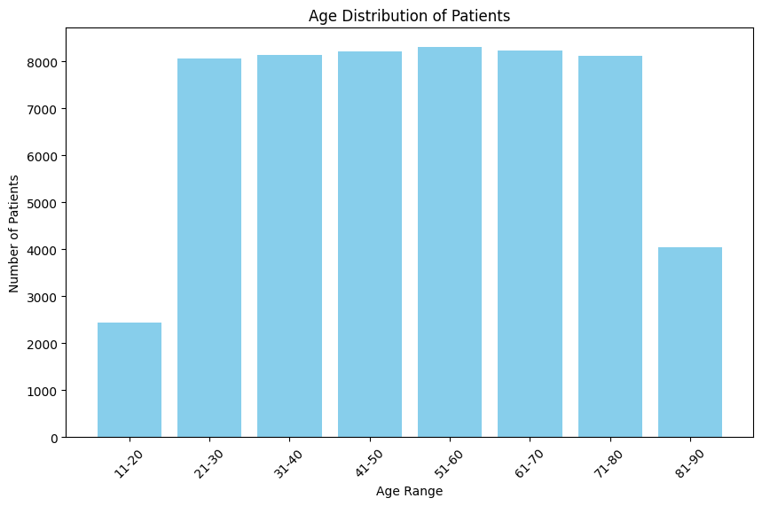
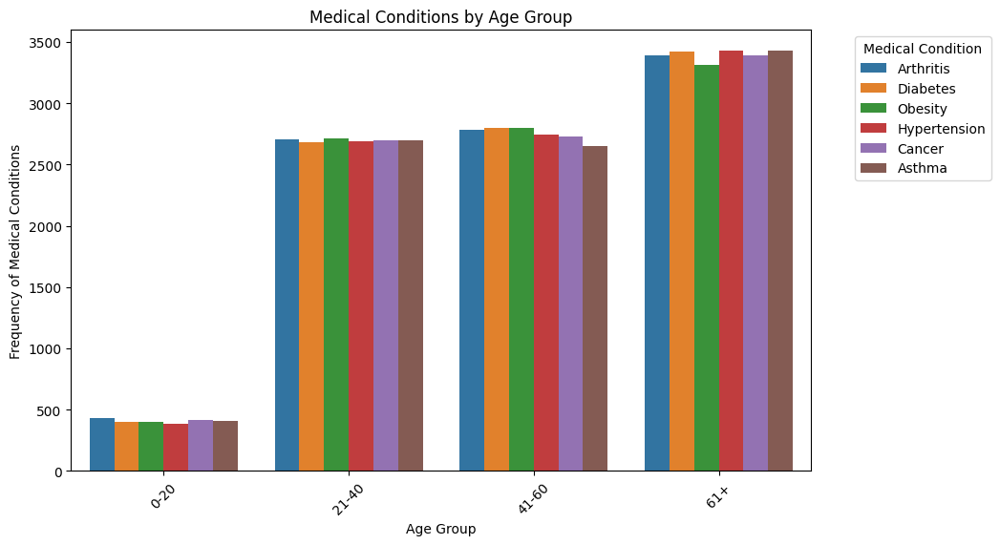
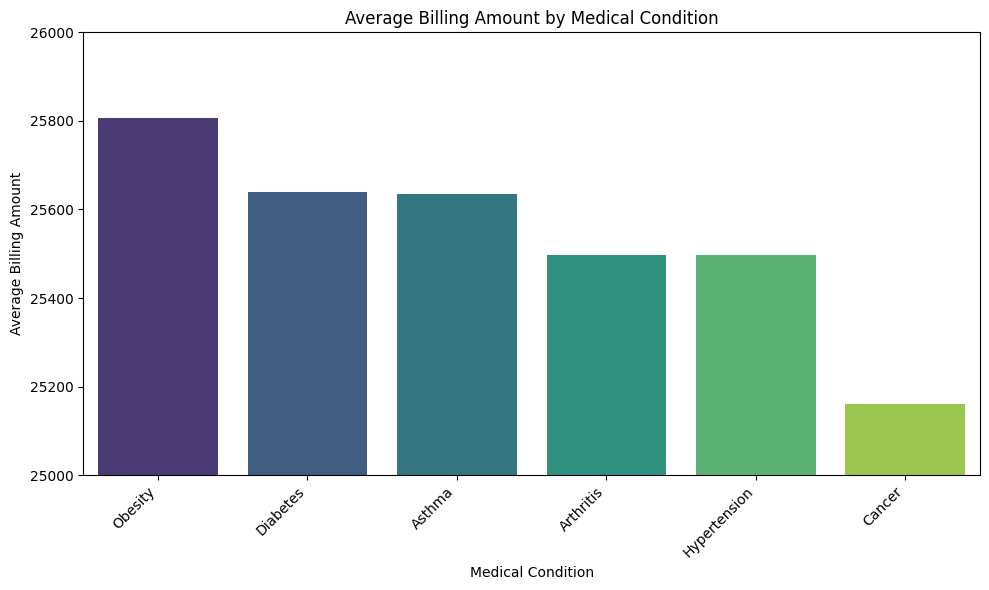
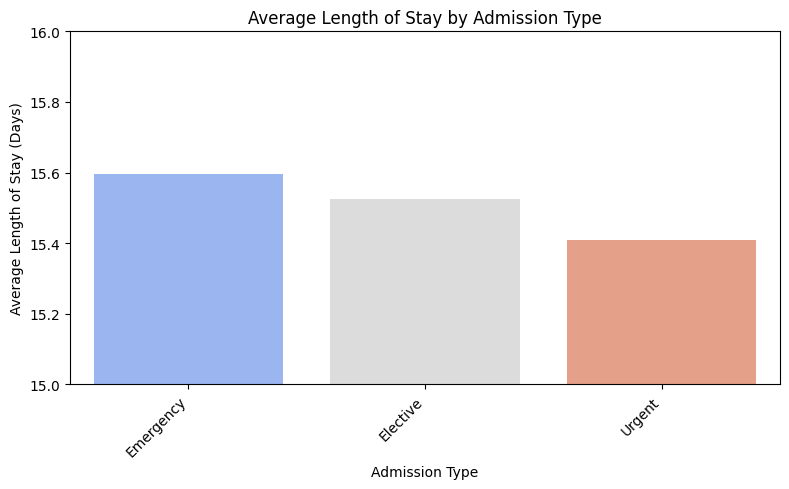
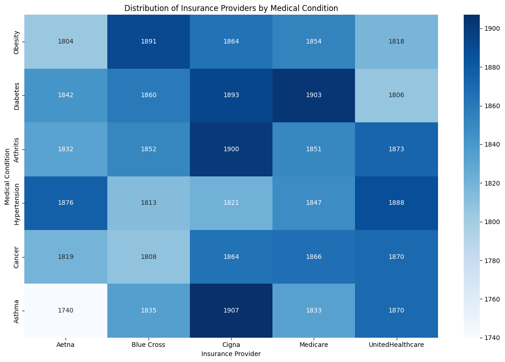
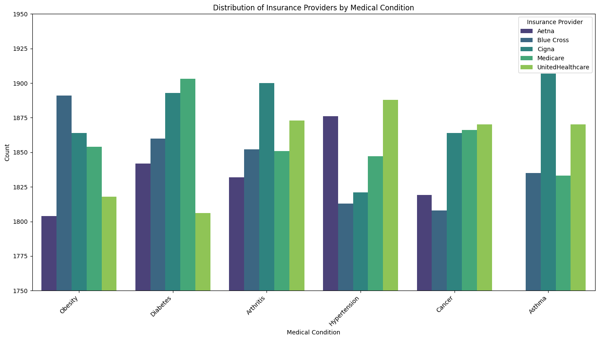
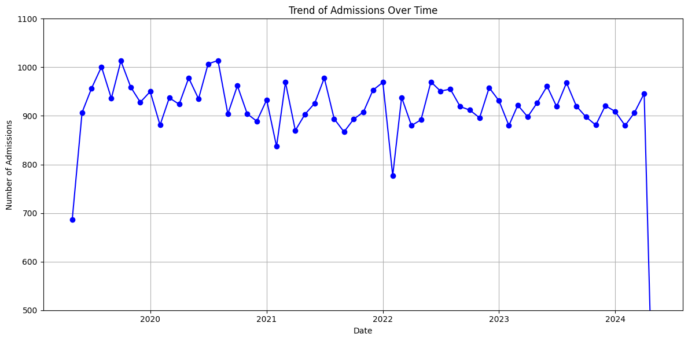
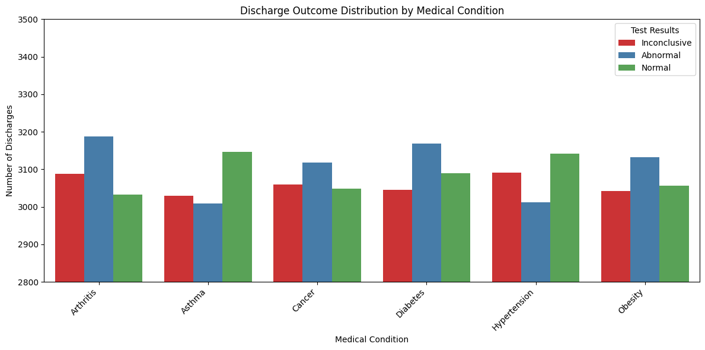

# Hospital Data Analysis

## **Overview**
This repository contains an end-to-end analysis of hospital data to uncover meaningful insights that can aid hospital operations, patient care, and cost management. The project focuses on answering specific business questions using structured and unstructured data analysis techniques.

## **Goals**
- Data cleaning and Preparation.
- Basic Data Exploration.
- Data Analysis.
- Advanced analysis, insights, visualization and intepretation

## **Key Questions Addressed**
1. **What is the distribution of patient ages?**: We analyzed the age distribution of patients to understand which age groups are most prevalent.
2. **What is the frequency of different medical conditions by age group?**: We explored how various medical conditions are distributed across different age groups.
3. **What is the average billing amount for each medical condition?**: We calculated the average billing amount for different medical conditions to identify the costliest conditions to treat.
4. **How long is the average hospital stay based on admission type?**: We analyzed the average length of hospital stays for different types of admissions (Emergency, Elective, Urgent).
5. **What is the distribution of insurance providers by medical condition?**: We examined the frequency distribution of insurance providers for each medical condition to understand which insurers are most common for specific conditions.
6. **What are the admission trends over time?**: We analyzed the number of admissions over time to identify any trends or patterns.
7. **What is the test result distribution across different conditions?**: We explored the distribution of test results (normal, abnormal, inconclusive) across different medical conditions.

### Link to Notebook >> [Link](notebooks/Health%20Care%20Dataset%20using%20Pyspark.ipynb)

## **Project Structure**
```
Hospital-Data-Analysis/
│
├── data/
│   ├── healthcare_dataset.csv                     # Original dataset
│
├── notebooks/
│   ├── Health Care Dataset using Pyspark.ipynb    # Data cleaning and preparation
│   ├── Health Care Dataset using Pyspark.pdf      # pdf version
│
├── reports/
│   ├── screenshots/                               # Screenshots of charts
│   └── presentation.pptx                          # Presentation of findings to public
│
├── scripts/
│   ├── clean_hospital_names.py                    # custom function
│   └── define_age_groups.py                       # custom function
│
└── README.md                                      # Repository documentation
```

## **Requirements**
- Python 3.x
- Pandas
- Matplotlib
- Seaborn
- PySpark

## **Usage**
1. Clone the repository:
   ```bash
   git clone https://github.com/MayoLJS/Hospital-Data-Analysis.git
   ```

2. Install the required dependencies:
   ```bash
   pip install -r requirements.txt
   ```

3. Run the Jupyter Notebooks in the `notebooks/` directory to explore the analyses.

## **Insights**
- **Age Distribution**: Majority of the patients are aged between 51-60, which is indicative of the age group that predominantly requires medical attention.

  
- **Medical Conditions by Age Group**: Ages 61 and above have the highest occurrence of medical conditions, with Diabetes, Hypertension, and Asthma slightly more prevalent than other conditions.

  
- **Average Billing Amount**: Obesity has the highest average treatment cost among all medical conditions, indicating it is the most expensive to manage.


- **Average Length of Stay**: Emergency admissions result in the longest hospital stays, followed by Elective and Urgent admissions.

  
- **Insurance Provider Distribution**: Heatmap displays the concentration of insurance providers for each medical condition. For instance, Cigna is the most common for athsma, while Aetna is least for same asthma while the grouped bar chart highlights individual contributions of each provider per condition. This can inform partnerships with specific insurers based on the medical conditions they most commonly cover such as Blue cross for Obesity, Medicare for diabetes, Cigna for Arthritis, etc.



- **Admission Trends**: June, July, and August see peak hospital admissions, indicating a seasonal trend in healthcare needs.


- **Test Results Distribution**: Hypertension has the highest number of abnormal test results, with a significant portion of test results being inconclusive or normal.



## **License**
This project is licensed under the MIT License. See the LICENSE file for details.

## **Contributors**
- Mayowa Osimosu (https://github.com/MayoLJS)
- Feel free to contribute by opening issues or submitting pull requests.

---

😊😊
